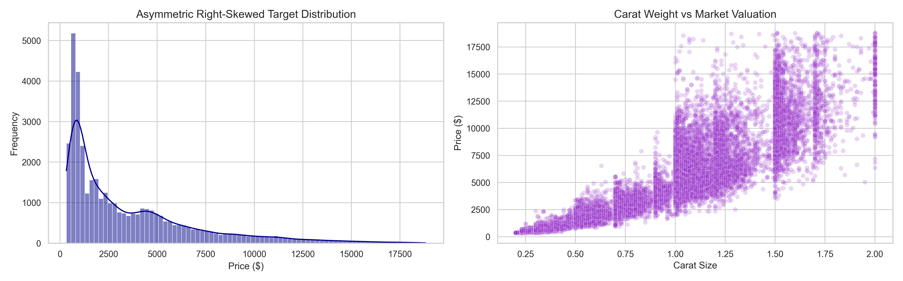
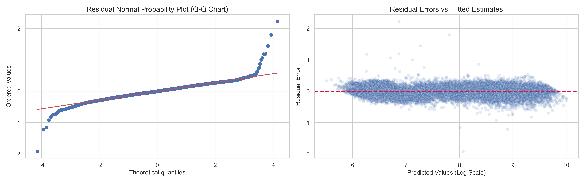

# 📊 Statistical Modeling and Inferencing (SMI) — Assignment 1

| Metadata Field | Value |
| :--- | :--- |
| **Student Name** | **Abhiram** |
| **Course / Subject** | **Statistical Modeling and Inferencing (SMI)** |
| **Current Status** | **Completed & Verified** |

---

## 📌 Overview

This repository contains a complete end-to-end **statistical modeling and regression analysis** on the [Diamonds Dataset](https://ggplot2.tidyverse.org/reference/diamonds.html). The goal is to identify the key physical and qualitative determinants of diamond pricing using rigorous statistical methods.

The analysis follows the methodological guidelines of **SMI Assignment 1** and covers data exploration, preprocessing, model building, diagnostics, and inference.

---

## 📁 Repository Structure

```
📦 Statistical-Modeling-and-Inferencing-SMI-
 ┣ 📓 2025EM1300289_SMI_Assignment.ipynb    # Main Jupyter Notebook (full analysis)
 ┣ 📄 2025EM1300289_SMI_Assignment_Report.pdf # PDF Executive Report (embedded figures)
 ┣ 🐍 build_smi_pdf.py                     # ReportLab PDF report generator
 ┣ 📊 diamonds.csv                          # Dataset (~53,940 diamond records)
 ┣ 🖼️ part1_visual_profiles.png             # Exploratory visual plots
 ┣ 🖼️ part2_model_diagnostics.png           # OLS Model diagnostic plots
 ┗ 📖 README.md                             # Repository documentation
```

---

## 🔍 Analysis Breakdown

### Part 1 — Data Exploration & Preparation *(6 Marks)*
- Descriptive statistical profiling of all features
- Detection and treatment of missing values and outliers
- Encoding of categorical variables (cut, color, clarity)
- Feature transformation and preprocessing pipeline

### Part 2 — Regression Modeling & Diagnostics *(12 Marks)*
- Ordinary Least Squares (OLS) regression via `statsmodels`
- Multicollinearity analysis (VIF)
- Model selection and variable reduction
- Residual diagnostics: normality, homoscedasticity, autocorrelation

### Part 3 — Statistical Inference & Interpretation *(7 Marks)*
- Hypothesis testing on regression coefficients
- Confidence intervals and effect size interpretation
- Key findings on diamond price determinants

---

## 🧰 Tech Stack

| Tool | Purpose |
|------|---------|
| **Python 3** | Core language |
| **pandas / numpy** | Data manipulation |
| **statsmodels** | OLS regression & statistical inference |
| **scikit-learn** | Preprocessing & dimensionality reduction |
| **matplotlib / seaborn** | Visualizations |
| **Jupyter Notebook** | Interactive analysis environment |

---

## 🚀 Getting Started

### 1. Clone the repository
```bash
git clone https://github.com/Abhiram1213/Statistical-Modeling-and-Inferencing-SMI-.git
cd Statistical-Modeling-and-Inferencing-SMI-
```

### 2. Install dependencies
```bash
pip install pandas numpy statsmodels scikit-learn matplotlib seaborn jupyter
```

### 3. Launch the notebook
```bash
jupyter notebook stats_assignment_new.ipynb
```

---

## 📈 Key Results

- **Dataset:** 53,940 diamonds with features: carat, cut, color, clarity, depth, table, x, y, z, price
- **Target Variable:** `price` (USD)
- **Best Model:** Multiple Linear Regression on log-transformed price
- **Key Predictors:** `carat`, `clarity`, `cut`, and `color` emerged as the strongest price determinants

---

## 🖼️ Visual Highlights

### Part 1 — Exploratory Visualizations


### Part 2 — Model Diagnostic Plots


---

## 📄 License

This project is submitted for academic purposes as part of the SMI course (Cohort 3). All analysis and code is original work by **Abhiram**.
